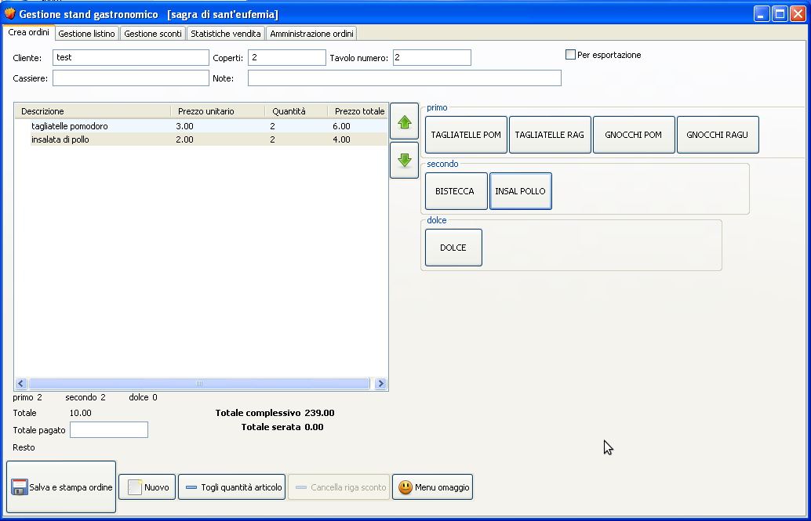

Requisiti App Feast Orders

L’applicazione consente la configurazione di listini per sagre paesane, la creazione e la gestione di ordini al tavolo o da asporto.

Attualmente viene usata l’applicazione [gestione stand gastronomico](http://www.gestionestandgastronomico.it/index.php?id=screenshot). L’applicazione viene utilizzata da un unico pc situato in cassa: le persone compilano un foglio con la comanda, da presentare in cassa, la persona che è in cassa riceve la comanda, compila l’ordine e lo stampa per il cliente e per cucina, bar tramite l’applicazione. Le stampa dell’ordine completo vale come ricevuta.

# Funzionalità App Gestione Stand Gastronomico

App desktop windows.

L’app si divide in una serie di tab che consentono la configurazione dell’applicazione e la gestione degli ordini:

1. Crea ordini (necessario)

2. Gestione listino (necessario)

3. Gestione sconti (opzionale, priorità bassa)

4. Statistiche vendita (opzionale, priorità media)

5. Magazzino (non necessario)

6. Amministrazione ordini (non necessario)

Inoltre l’app consente di configurare le stampanti dove inviare gli ordini (dal menù in alto a sinistra File > Configurazione).

Flusso di configurazione:

1. da tab amministrazione ordini si avvia la giornata

2. da tab gestione listino si definiscono le categorie (bibite, panini, birre, ecc.) e le stampe

3. configurazione stampanti

Tab di gestione:

* creazione ordini

* statistiche giornata

 

## Tab Amministrazione ordini

*All'inizio di ogni giornata della sagra è necessario fare un inizio giorno; in questo modo le statistiche di vendita di quella determinata giornata prenderanno in considerazione gli ordini fatti a partire da quel momento. Allo stesso modo, quando la giornata della sagra ha avuto termine è necessario fare il fine giorno: in questo modo vengono elaborate le statistiche di vendita di quel giorno.*

### Valutazioni

* il tab non è necessario

* la funzionalità "Inizio/fine giornata" potrebbe essere utile per garantire un backup degli ordini effettuati in quella giornata: al termine della giornata viene eseguito il backup.

* capire se ha può essere utile una ricerca sugli ordini, magari per capire se un ordine è corretto o meno o nel caso di contestazioni da parte del cliente.

## Tab Gestione listino

*Da qui si possono inserire le pietanze con la possibilità di decidere in quale stampa andrà l'articolo in inserimento (stampa cucina e/o stampa bar, la stampa cliente viene fatta automaticamente)*

### Valutazioni

La funzionalità è necessaria, in particolare serve

* CRUD categorie

* CRUD voce listino con associazione ad una categoria e prezzo

* scelta della stampa (copie) di una voce del listino -> le copie stampa vanno configurate?

## Tab Creazione ordini

*La parte sinistra viene popolata con l'ordine corrente, mentre sulla destra trovano posto le pietanze e gli sconti inseriti rispettivamente su gestione listino e gestione sconti*

### Valutazioni

La funzionalità è necessaria. La funzionalità viene usata sia dalle persone che operano in cassa (amministratori) sia dalle persone che prendono le ordinazioni.

## Tab Sconti

### Valutazioni

La funzionalità non è strettamente necessaria, solitamente viene usata una percentuale di sconto sull’intero ordine.

## Tab Statistiche

### Valutazioni

La funzionalità non è strettamente necessaria, viene usata per raccogliere il

* numero di ordini nella giornata

* soldi incassati nella giornata

* numero di voci di listino ordinate

## Pagina configurazione stampanti

Consente di configurare le stampanti, scegliendo da quelle visibili nel sistema operativo, e inserendo i margini di stampa e il formato stampa.

### Valutazioni

La funzionalità è necessaria. Capire come recuperare le stampanti.

Per l’implementazione delle stampanti:

[https://www.tabnine.com/code/java/classes/javax.print.PrintService](https://www.tabnine.com/code/java/classes/javax.print.PrintService)

[https://docs.oracle.com/javase/7/docs/api/javax/print/PrintServiceLookup.html](https://docs.oracle.com/javase/7/docs/api/javax/print/PrintServiceLookup.html)

Da provare ad utilizzare il PrintService e PrintServiceLookup (in teoria questo torna una lista di stampanti installate nel OS) 

utilizzeremo delle API per la gestione delle stampanti.

# Nuova App Feast Orders

Web application che gira su desktop e su dispositivi mobile (telefoni o tablet).

Per il momento l’applicazione gira in locale e non su cloud (soluzione on-premises), questo a causa della mancanza della rete internet. In futuro si può prevedere una soluzione cloud oriented.

## Infrastruttura

Si dispone di 

* un router che consente di connettere via cavo o wifi i dispositivi come i pc, telefoni e stampanti. Il router è isolato e non connesso alla rete internet.

* 1 o 2 pc massimo da utilizzare in cassa: uno dei due (pc amministratore) funge da server e mette a disposizione il BE + database.

* 2 o più dispositivi mobile (telefoni o tablet) utilizzati per raccogliere gli ordini

* 4 stampanti (wireless e non), utilizzate

    * 1 in cassa per stampare gli ordini completi, stampa in formato piccolo (capire formato)

    * 1 in bar per stampare solo le bibite, stampe in formato A5

    * 2 stampanti in cucina, 1 per i fritti in formato piccolo, 1 per i panini in formato A5

Considerare che ci potrebbero essere interferenze nella connessione tra dispositivi e router dovute al microfono.

## Architettura software

Da capire, cmq molto probabile:

* Database postgres o sqllite

* App BE Spring Boot

* App FE Angular

## App BE

Spring Boot App + hibernate + spring data.

Valutare se utilizzare anche Spring Security per garantire un minimo di autenticazione (login) e di autorizzazione sulle API in base al ruolo degli utenti.

Lombok

Notifiche? No, polling

## App FE

Utilizza Angular, deve essere responsive quanto basta per consentire di creare gli ordini da dispositivi mobile. Capire quale libreria di componenti usare. Tutte le altre funzionalità possono essere eseguite da desktop.

Boz: utilizziamo bootstrap. facile e lo conosciamo

## Pagine

Parte configurazione

1. Pagina listino per la creazione/modifica/cancellazione delle categorie e creazione/modifica/cancellazione voce listino

2. Pagina per la configurazione delle postazioni e delle stampanti

3. Dashboard per statistiche (opzionale)

4. Pagina riepilogo/ricerca ordini

Pagina creazione ordini -> molto probabilmente serve mantenere le bozze degli ordini

Pagina login

### Pagina listino 

Sezione di aggiunta/modifica categoria

Sezione di aggiunta/modifica voce listino, con associazione alla categoria

### Pagina configurazione postazioni e stampanti

Sezione di aggiunta/modifica/rimozione postazione (cucina, bar, cassa).

Ad ogni postazione può essere configurata una o più stampanti: ad esempio in cassa sono collegate due stampanti.

La pagina deve consentire di scegliere dalle stampanti presenti a sistema e di associarle alle postazioni.

Capire come recuperare le stampanti.

### Dashboard statistiche

TODO

### Riepilogo/Ricerca ordini

Pagina che riporta lo storico degli ordini ricercabile e filtrabile. Al click sull’ordine si vede il dettaglio. Tra le info si può riportare anche lo stato.

La pagina è necessaria per ricercare gli ordini e poterli stampare nuovamente.

### Pagina creazione ordini

Form per inserire le informazioni base dell’ordine, cioè:

* nome cliente

* numero coperti

* numero tavolo

* per asporto

* eventuali note associate all’intero ordine

Composizione ordine

* sezione delle voci listino selezionabili per comporre l’ordine, alla selezione si sceglie anche la quantità. Raggruppabili per categoria.

* sezione di dettaglio dell’ordine che riporta il nome della voce di listino, prezzo unitario, quantità, prezzo totale e consente di eliminare o aggiungere direttamente da li.

Sezione con totale ordine e totale dell’intera giornata.

Azioni

* campo per inserimento percentuale sconto

* supporto al pagamento: campo per inserimento soldi dati + calcolo del resto

* salvataggio dell’ordine e stampa

* salvataggio in bozza dell’ordine (opzionale)

### Login

Form con username e password. Gli utenti li registriamo a DB. All’accesso si viene reindirizzati verso la pagina di creazione ordini.

## Ruoli

Esistono due tipologie di utenti

1. utenti amministratori (admin), possono accedere a tutte le pagine dell’app e configurare e creare ordini

2. utenti camerieri (waiter), possono accedere solo alla pagina di creazione degli ordini

## Stampe

Tutte le stampe sia quelle piccole che in formato A5 riportano come intestazione

* nome cliente

* numero coperti

* numero tavolo

* ora comanda

* progressivo (se possibile)

Poi si differenziano nel contenuto, ad esempio le stampe in cassa riporta la lista degli ordini con tutto, comprese anche le note, quelle in cucina riportano solo le bibite.

Da sinistra a destra, stampa copia cucina, stampa ordine completo (copia cliente), stampa copia bar

**Progressivo: **aggiungere 2 api per apertura e chiusura cassa, da capire se è fattibile gestendo un Thread evitando transazioni a db, oppure tramite query verificare se la cassa è aperta per data apertura = oggi, recupero l’ultimo record ed aumento il progressivo, oppure utilizzando una sequence (da capire come azzerare in esecuzione)

da provare a gestire il progressivo tramite spring config/bean con un Integer all’interno del bean + data

## Struttura DB

@MappedSuperclass

BaseEntity

 id,name,creationTimestamp,creationUser,updateTimestamp,updateUser,version.

Entity User

id, name, surname, username, password, device?

Entity PrinterCfg (rappresenta la configurazione di una stampante di sistema)

id, name, description, printerName, printerAttrs (map<string, obj> con paperformat, copiesnumber, margini?)

Entity Category extend BaseEntity 

id, name, description, color

Entity MenuItem extend BaseEntity

id, name, description, price, color

Entity Order

id, client, tableNumber, placeSettingNumber, orderTime, progressNumber, discount, total

Associazione N-N MenuItem (o Category) - PrinterCfg

Associazione 1-N Category - MenuItem

Associazione N-N Order - MenuItem -> entity OrderMenuItem

Entity OrderMenuItem

order_id (PK, FK), menuitem_id (PK, FK), quantity

## API

Risorsa /category

Risorsa /category/{categoryId}/menuitem - per associazione category - menuitems

Risorsa /order

Risorsa /oder/{orderid}/menuitem - per associazione order - menuitems

Risorsa /printercfg - per configurazioni stampanti

Risorsa /printer per lista di stampanti disponibili

Risorsa /menuitem/{menuitemid}/printer - per associazione menuitem - config stampanti

Da capire se servono i seguenti endpoint su:

1. risorsa MenuItem

**Repository ufficiale**

https://github.com/bozzaccio/feast-orders

